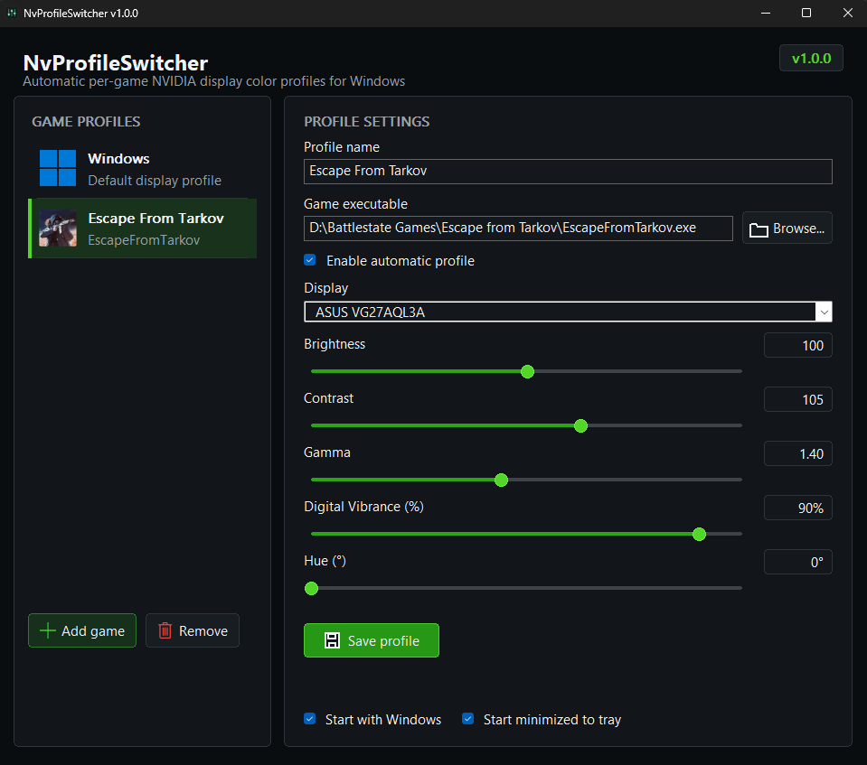
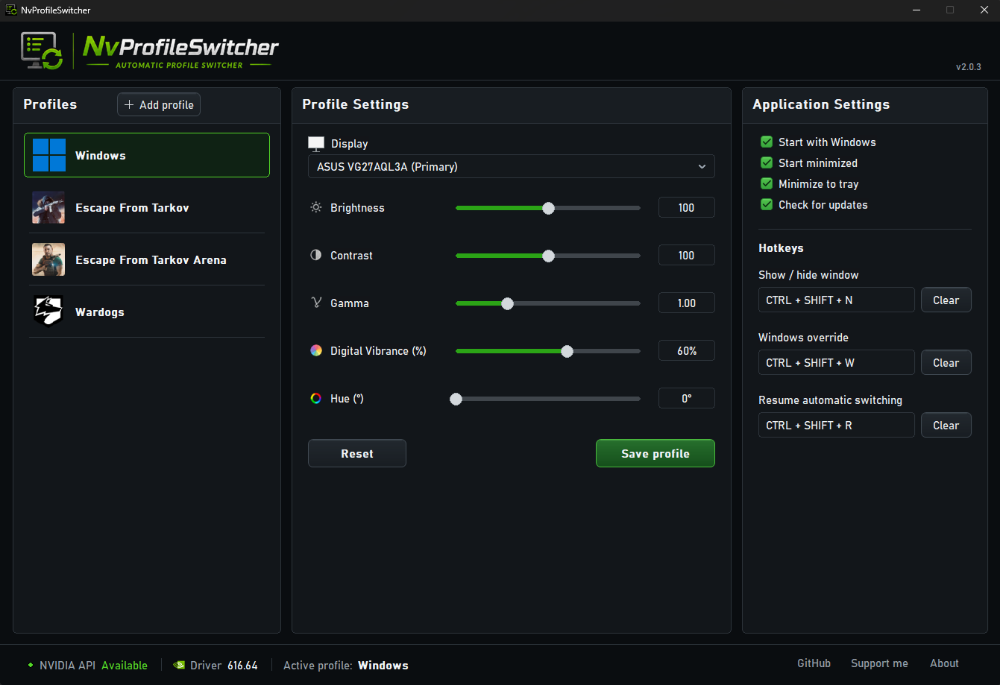
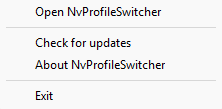

# NvProfileSwitcher

**Automatic per-game NVIDIA display color profiles for Windows.**

NvProfileSwitcher is a lightweight native Windows utility that automatically
switches NVIDIA display color settings based on the application currently in
the foreground.

Configure your normal Windows colors once, create individual profiles for your
games, and NvProfileSwitcher handles the switching automatically.

When a configured game becomes active, its color profile is applied. As soon
as you switch back to Windows, your browser, Discord, or another application,
your Windows profile is automatically restored.

> NvProfileSwitcher is not affiliated with, endorsed by, or sponsored by
> NVIDIA Corporation. NVIDIA is a trademark of NVIDIA Corporation.

## Features

- Automatic per-game profile switching
- Automatic Windows profile restoration
- Profiles matched by game executable (`.exe`)
- Brightness control
- Contrast control
- Gamma control
- Digital Vibrance control
- Hue control
- Per-display profiles
- Multi-monitor support
- Separate Windows color settings for each configured display
- Individual game executable icons
- Enable or disable individual game profiles
- Start automatically with Windows
- Start minimized to the system tray
- Optional minimize-to-tray behavior
- Single-instance support
- Built-in update checker
- Lightweight native C++ application
- Portable — no installation required
- No .NET runtime required

## Screenshots

### Game Profile

### Windows Profile

### System Tray

## Installation

Download the latest version from the **Releases** section.

Before extracting the archive, Windows may mark the downloaded file as coming
from the Internet. To avoid Windows blocking the executable:

1. Right-click `NvProfileSwitcher-vX.X.X.zip`.
2. Select **Properties**.
3. Under the **General** tab, check **Unblock** if the option is available.
4. Click **Apply** and **OK**.
5. Extract the ZIP and run `NvProfileSwitcher.exe`.

No installer or additional runtime is required.

### Windows SmartScreen

NvProfileSwitcher is currently distributed as an unsigned executable. Because
of this, Microsoft Defender SmartScreen may display a warning when launching
the application for the first time.

This warning does not necessarily indicate that NvProfileSwitcher contains
malware. Unsigned applications with limited download reputation can trigger
SmartScreen until they establish sufficient reputation.

Always download NvProfileSwitcher from the official GitHub repository or its
Releases page.

### Requirements

- Windows 10 or Windows 11 (x64)
- NVIDIA GPU
- NVIDIA display driver with NVAPI support

## Usage

1. Launch `NvProfileSwitcher.exe`.
2. Select **Windows** and configure your normal desktop color settings.
3. Click **Add game**.
4. Select the game's executable.
5. Choose the display where the game runs.
6. Configure the desired color settings.
7. Click **Save profile**.

NvProfileSwitcher will now detect when that game owns the foreground window
and automatically apply its profile.

Switch away from the game and your Windows profile is restored automatically.

## Color controls

Each profile can independently configure:

| Setting | Range |
| --- | ---: |
| Brightness | 80–120 |
| Contrast | 80–120 |
| Gamma | 0.30–2.80 |
| Digital Vibrance | 0–100% |
| Hue | 0–359° |

The controls are applied directly through the NVIDIA display pipeline / NVAPI.

## Multi-monitor support

NvProfileSwitcher detects available NVIDIA displays and allows Windows and game
profiles to store independent color settings for each monitor.

Selecting a different display shows the values saved specifically for that
monitor.

When a configured game becomes active, NvProfileSwitcher applies the saved game
settings to the corresponding displays. When you leave the game, each monitor
returns to its own saved Windows color profile.

## System tray

NvProfileSwitcher can run silently from the Windows system tray.

The tray menu provides:

- Open NvProfileSwitcher
- Check for updates
- About NvProfileSwitcher
- Exit

The **Minimize to tray** option controls the behavior of the minimize button.

When enabled, minimizing NvProfileSwitcher hides it in the system tray.
When disabled, the application minimizes normally to the Windows taskbar.

The **Start with Windows** option allows NvProfileSwitcher to launch
automatically when you sign in to Windows.

The **Start minimized to tray** option allows it to start directly in the
system tray while handling profile switching in the background.

## Update checker

NvProfileSwitcher checks GitHub for new releases when the application starts.

You can also manually check for updates from the system tray menu.

If a newer version is available, a notification provides a direct link to the
latest GitHub release.

No automatic installation or background updater is used.

## Configuration

Profiles and application settings are stored in:

`%APPDATA%\NvProfileSwitcher\profiles.json`

The configuration file is created automatically.

## How it works

NvProfileSwitcher monitors the application that currently owns the foreground
window.

When its executable matches an enabled game profile, the corresponding NVIDIA
color settings are applied to the configured displays.

When the foreground application no longer matches a configured game,
NvProfileSwitcher restores the saved Windows profiles for each display.

Digital Vibrance and Hue are controlled through NVIDIA NVAPI.

Brightness, Contrast and Gamma are applied using the NVIDIA display pipeline
gamma correction LUT.

NvProfileSwitcher communicates directly with `nvapi64.dll` and does not need
the NVIDIA App to remain open.

> If another application is also controlling NVIDIA color settings, such as
> vibranceGUI, close it before using NvProfileSwitcher to prevent both
> applications from modifying the same display settings.

## Building

NvProfileSwitcher is built as a native x64 Windows application using:

- C++20
- MSVC x64
- Windows Win32 API
- NVIDIA NVAPI
- Static C/C++ runtime (`/MT`)

GitHub Actions automatically produces development builds from `main` and
versioned builds from release tags.

Development builds use:

`dev-<commit>`

Official releases use semantic versions such as:

`v1.0.0`

## Support

If you find NvProfileSwitcher useful and would like to support its development:

☕ **Buy me a coffee on Ko-fi**

https://ko-fi.com/mgcarnevali

## License

NvProfileSwitcher is licensed under the [MIT License](LICENSE).

Copyright © 2026 Maximiliano Carnevali.

## About

**NvProfileSwitcher** — Automatic per-game NVIDIA display color profiles for Windows.
