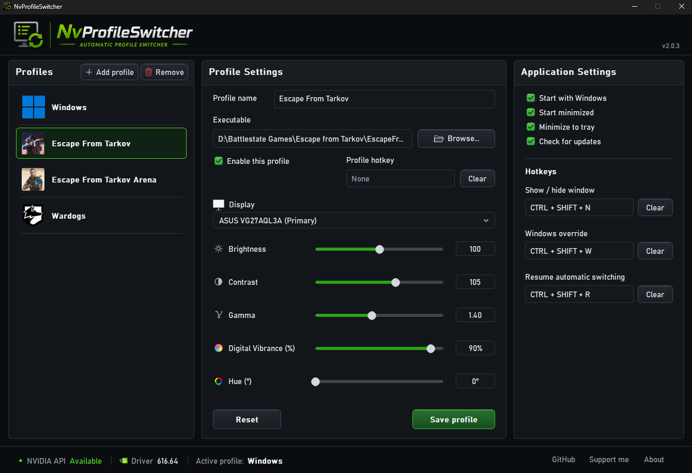

# NvProfileSwitcher

**Automatic per-application NVIDIA display color profiles for Windows.**

NvProfileSwitcher is a lightweight native Windows application that automatically applies NVIDIA display color settings based on the application currently in use.

It allows you to create individual profiles for applications and games, with independent settings for each physical monitor.

## Features

- Automatic profile switching based on the foreground application
- Per-application display color profiles
- Independent settings for each monitor
- NVIDIA Digital Vibrance control
- NVIDIA Hue control
- Brightness control
- Contrast control
- Gamma control
- Live preview of display color adjustments while editing profiles
- Reset control to restore NVIDIA-neutral values while editing
- Windows/Desktop profiles
- Automatic restoration of Windows settings when leaving a configured application
- Stable physical monitor identification
- Profiles are preserved across NVIDIA driver updates and display topology changes
- Automatic detection of monitor connections and disconnections
- Newly detected monitors are automatically added to Windows and application profiles
- Multi-monitor support
- Start with Windows option
- Start minimized option
- Minimize to system tray option
- Automatic update checking
- Configurable application show/hide hotkey
- Windows profile override hotkey
- Per-application profile hotkeys
- Manual profile override mode
- Dedicated hotkey to resume automatic switching
- Shortcut conflict and AltGr-safe validation
- Dark application dialogs
- Portable version
- Windows installer
- Native Win32 application with no additional runtime required

## Screenshots

### Windows Profile


### Application Profile



### System Tray


## How it works

NvProfileSwitcher monitors the foreground application and automatically switches display settings when a configured executable becomes active.

Each application profile can contain independent settings for every detected physical monitor.

When no configured application is active, NvProfileSwitcher restores the corresponding Windows profile for each display.

Physical monitors are identified using stable monitor information rather than relying only on Windows `DISPLAY` numbers. This allows saved profiles to remain associated with the correct monitor even when Windows or an NVIDIA driver update changes display numbering.

## Display settings

Each monitor profile supports:

| Setting | Description |
|---|---|
| Digital Vibrance | NVIDIA Digital Vibrance setting |
| Hue | NVIDIA Hue setting |
| Brightness | Gamma-ramp brightness adjustment |
| Contrast | Gamma-ramp contrast adjustment |
| Gamma | Gamma-ramp gamma adjustment |

New monitor and application profiles start with neutral NVIDIA/default values:

- Digital Vibrance: **50%**
- Hue: **0°**
- Brightness: **100%**
- Contrast: **100%**
- Gamma: **1.00**

Once a profile is saved, its settings are preserved and restored whenever the same physical monitor is detected again.

## Live preview

Display setting changes are previewed immediately on the selected monitor while editing a profile.

Preview changes are not saved automatically. Switching profiles, changing displays, or minimizing the application discards unsaved preview changes and restores the currently saved settings.

The **Reset** button restores the controls to neutral NVIDIA/default values and previews them immediately. Reset values are only stored when **Save profile** is clicked.

## Usage

1. Launch `NvProfileSwitcher.exe`.
2. Configure the **Windows** profile for each monitor.
3. Click **Add profile** to create a new application profile.
4. Select the application's **Executable**.
5. Configure the desired display settings for each monitor. Changes are previewed live while editing.
6. Use **Reset** to return the selected monitor to neutral NVIDIA/default values if needed.
7. Click **Save profile** to save the changes.
8. Enable the profile.

Optionally, assign a profile hotkey to activate it manually. Pressing the same hotkey again ends the override and resumes automatic foreground-application detection.

NvProfileSwitcher will automatically apply the profile when the configured executable becomes the foreground application.

When the application is no longer active, the Windows profile is restored automatically.

## Hotkeys

NvProfileSwitcher supports three application-wide hotkey actions:

- **Show / hide window** toggles the main application window.
- **Windows override** pins the Windows display profile until the override is cancelled.
- **Resume automatic switching** ends any manual override and immediately reevaluates the foreground application.

Each enabled application profile can also have its own hotkey. Activating it applies that profile to all configured displays and starts a manual override. Pressing another profile hotkey switches the override; pressing the active profile hotkey again returns to automatic switching.

Function keys can be assigned without modifiers. Other shortcuts require Ctrl or Alt. Ctrl + Alt combinations are blocked because Windows can interpret the AltGr key as Ctrl + Alt.

The same shortcut cannot be assigned to more than one global action or application profile. **Clear** removes an assignment.

## Multi-monitor support

NvProfileSwitcher stores settings independently for each physical monitor.

Each monitor is assigned a stable identifier derived from its hardware information. This prevents profiles from being incorrectly reassigned when Windows changes display numbers such as:

```text
\\.\DISPLAY1
\\.\DISPLAY2
\\.\DISPLAY3
```

For example, after a driver update the same physical displays may become:

```text
\\.\DISPLAY6
\\.\DISPLAY7
\\.\DISPLAY8
```

NvProfileSwitcher maps the saved profile back to the physical monitor instead of treating it as a new display.

Different physical monitors can also reuse the same Windows `DISPLAY` number at different times without sharing their saved profiles.

Monitor connections and disconnections are detected automatically while NvProfileSwitcher is running.

## Profiles

Profiles are stored locally in:

```text
profiles.json
```

The configuration contains:

- Windows profiles
- Application profiles
- Executable paths
- Per-monitor settings
- Stable physical monitor identifiers

Disconnected monitors remain stored in the configuration so their settings can be restored when they are connected again.

## Portable version

The portable release does not require installation.

Extract the ZIP file and run:

```text
NvProfileSwitcher.exe
```

Application configuration is stored separately from the executable.

## Windows installer

NvProfileSwitcher is also available as a standard Windows installer.

The installer places the application under:

```text
C:\Program Files\NvProfileSwitcher
```

and provides the normal Windows installation/uninstallation experience.

## Requirements

- Windows 10 or Windows 11
- NVIDIA GPU
- NVIDIA display driver

NvProfileSwitcher uses the NVIDIA API for Digital Vibrance and Hue control.

Brightness, Contrast and Gamma adjustments are applied through the Windows display gamma ramp.

## Building from source

NvProfileSwitcher is a native Win32 C++20 application.

The project is built with Microsoft Visual C++.

Example build process:

```cmd
rc /nologo app.rc
cl /nologo /std:c++20 /O2 /EHsc /MT /DUNICODE /D_UNICODE /DNOMINMAX main.cpp switching_core.cpp hotkey_core.cpp app.res /Fe:NvProfileSwitcher.exe /link /SUBSYSTEM:WINDOWS /MACHINE:X64
```

The `/MT` option statically links the Microsoft C/C++ runtime.

Release and development builds are also generated automatically using GitHub Actions.

### Build versions

Release builds use the Git tag:

```text
vMAJOR.MINOR.PATCH
```

For example:

```text
v2.0.0
```

Development builds use the short Git commit hash:

```text
dev-abcdef1
```

## Project structure

```text
NvProfileSwitcher/
├── assets/
│   ├── branding/
│   │   ├── NvProfileSwitcher.ico
│   │   ├── header.png
│   │   ├── installer-large.bmp
│   │   └── installer-small.bmp
│   └── icons/
│       ├── brightness.png
│       ├── contrast.png
│       ├── gamma.png
│       ├── hue.png
│       ├── nvidia.png
│       ├── section-app-settings.png
│       ├── section-profile-settings.png
│       ├── section-profiles.png
│       └── vibrance.png
├── app.manifest
├── app.rc
├── hotkey_core.cpp
├── hotkey_core.h
├── main.cpp
├── resource.h
├── switching_core.cpp
├── switching_core.h
├── tests/
│   ├── hotkey_core_tests.cpp
│   └── switching_core_tests.cpp
├── version.h
└── installer/
    └── NvProfileSwitcher.iss
```

## Releases

Release builds are available from the GitHub **Releases** section.

Each release provides:

- Portable ZIP
- Windows installer

Development builds generated from `main` are available as GitHub Actions artifacts.

## Contributing

Contributions are welcome.

Before submitting changes, please read [CONTRIBUTING.md](CONTRIBUTING.md).

Bug reports, improvements and pull requests can be submitted through GitHub.

## License

NvProfileSwitcher is licensed under the [GNU General Public License v3.0](LICENSE).

You may redistribute and/or modify NvProfileSwitcher under the terms of the GNU General Public License as published by the Free Software Foundation, version 3.

See the [LICENSE](LICENSE) file for the full license text.

Copyright © 2026 Maximiliano Carnevali.

## Author

**Maximiliano Carnevali**

GitHub: [mgcarnevali](https://github.com/mgcarnevali)

## Support

If you find NvProfileSwitcher useful and would like to support its development, you can use the support link available in the application.
